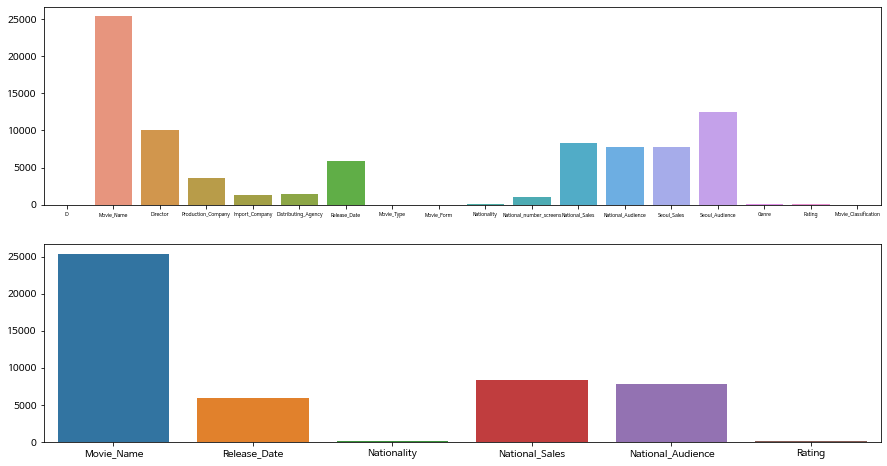
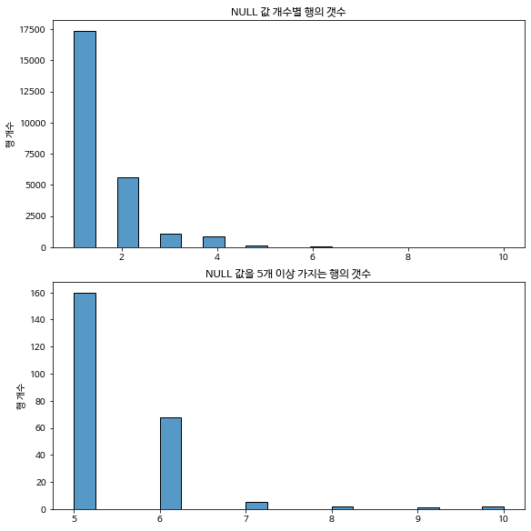
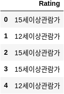
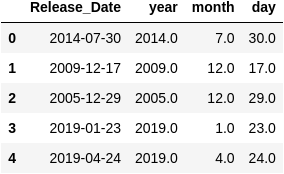
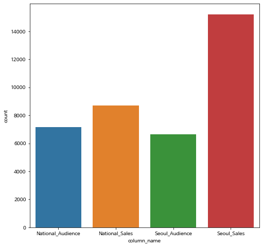
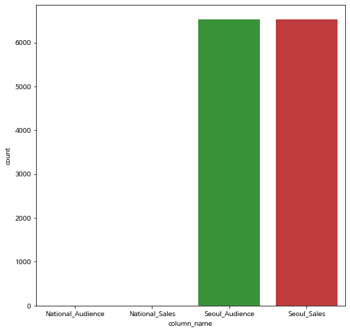

# Dataton - 대구 캠퍼스

## EagleAI

김용훈, 최지원, Daniel  

### 데이터 EDA

  
데이터는 영화관 입장권 통합 전산망입니다.  
크기는 26197행, 18열 입니다.  
행이 각각의 영화들이며  
열은 영화제목, 감독, 관련 회사들, 전국과 서울의 관객과 매출액 등이 있습니다.

중점적으로 볼 columns입니다.  
* Movie_Name : 영화 이름
* Relase_Date : 개봉 일자
* Nationality : 국적
* National_Sales : 전국 매출액
* National_Audience : 전국 관객수
* Rating : 등급

* 해당 열만 표시한 경우입니다.  
  

* 서로 다른 값의 개수를 열마다 나타냅니다.  
  

결측치를 확인해보겠습니다.  

* 행의 NULL 값  
  
null 값을 가지는 행의 개수를 null 개수 별로 시각화했습니다.  
5개 이상인 경우도 시각화하였습니다.  

* 열의 NULL 값  
  

### 데이터 전처리

1. NULL 값을 5개 이상 가지는 행을 삭제합니다.
2. NULL 값을 가지는 숫자열에 NULL 값을 0으로 채웁니다.
3. String 값을 가지는 열에 No_열이름으로 NULL 값을 채웁니다.
4. Nationality의 NULL 값은 직접 찾아서 채웁니다.
   * 변경 전  
  
   * 변경 후  
  
5. Rating은 원래 있던 값을 적은 수의 카테고리로 분류화한 csv 파일을 이용해 변경합니다.
* 변경 전  
  
* 새로운 csv  
  
* 변경 후  
   
6. Release_Date는 datetime으로 바꾼 뒤
   year, month, day로 나누고 삭제합니다.  
  

이제 NULL 값이 얼마나 있는지 출력해보면  
  
없습니다.  

### 데이터 이상치 제거
관심있는 열 중에서 이상치를 확인합니다.  
먼저 숫자열들이 이상치로 의심되는 0값이 경우를 확인합니다.  
* 숫자 열의 0의 개수  
  

해당 0은 2가지 의미가 있습니다.  
실제로 0인 경우와 통계를 받지 못해 0인 경우입니다.  
예시입니다.  
  

메타데이터를 찾아보니  
2011년부터는 통합전산망을 기준으로 일정한 주기(매월, 매년)로 마감 처리하여 산출되는 통계정보라 되어있습니다.  
그래서 제대로 정리된 2011년 부터의 데이터를 사용하겠습니다.  

바뀐 데이터로 0인 개수를 출력해보겠습니다.  
  

이제 지표들에 따른 시각화를 보겠습니다.  
